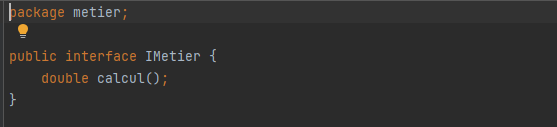
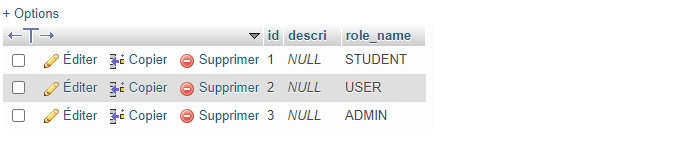
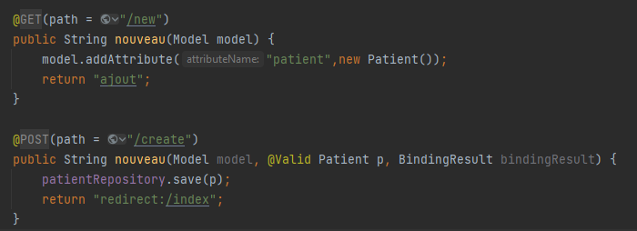

<h1 align="center">Mohamed ELYOUSFI</h1>
<h2 align="center"><💻 Compte Rendu des Travaux Pratiques JEE💻/></h2>

    
TP1 - Injection des dépendances par instanciation Statique/Dynamique/Framework<a href="https://github.com/ElyousfiMohamed/ELYOUSFI_Moahmed_JEE/tree/main/TP1%20-%20Semaine%201%20et%202%20(Injection%20de%20dependances)"> [Code source]</a>
 
    

        On considère le schéma suivant ou les classes sont liées par un couplage faible 
        

        <pre>Implémentation en java :
- Interface IDao et ses implémentations :</pre>
        
        
        
        <pre>- Interface IMetier et son implémentation :</pre>
        
        
        <h3>1- Injection des dépendances par instanciation Statique</h3>
        
        <pre>Résultat d'exécution :</pre>
        
        <h3>2- Injection des dépendances par instanciation Dynamique</h3>
        <pre>L'injection dynamique et faite à l'aide d'un fichier config.txt qui contient les noms des classes qui vont 
etre chargé dans la couche presentation</pre>
        
        <pre>1 : Chargement du fichier config.txt
2 : Lecture des noms complets(package + nom de la classe) des classes existant dans ce fichier
3 : Récuperation des instances de "Class" à partir des noms complet des classes 
4 : L'instanciation des classes(si ces classe ont un constructeur sans paramètre)
5 : Chargement et invocation(injection) du methode "setDao"</pre>
        
    <pre>Résultat d'exécution :</pre>
    
    <h3>3- Injection des dépendances avec Spring</h3>
    <pre><h4>3.1- Avec fichier beans.xml : </h4>
C'est un peu comme le principe de fichier de configuration dans l'injection dynamique, 
mais ici les instances sont passé a travers des beans</pre>
    
    <pre>Et aprés on va récupurer les beans par la méthode <b>"getBean"</b></pre>
    
    <pre>Résultat d'exécution :</pre>
    
    <pre><h4>3.2- Avec les annotations : </h4></pre>
    
    
    
    <pre>Résultat d'exécution :</pre>
    
    

---

    
TP2 - Java Persistence API (JPA) <a href="https://github.com/ElyousfiMohamed/ELYOUSFI_Moahmed_JEE/tree/main/TP2%20-%20Java%20Persistence%20API%20(JPA)"> [Code source]</a>

     
    

        <h3>Spring Data</h3> 
        
        <h3>Application.properties</h3>   
        
        <h3>Entité Patient</h3>  
        
        <h3>Patient Repository</h3>  
         
        <h3>Application Spring</h3>  
         
        <h3>h2-console</h3>  
         
        <h3>Table Patient</h3>  
         
    

---

    
TP2 - JPA (Associations OneToOne, ManyToOne) <a href="https://github.com/ElyousfiMohamed/ELYOUSFI_Moahmed_JEE/tree/main/TP2%20-%20JPA%20(Associations%20%20OneToOne%2C%20ManyToOne)"> [Code source]</a>

     
    

        <h3>Diagramme de classe</h3>
        
        <h3>Les modeles</h3>
        <h5>- Consultation</h5>
        
        <h5>- Medecin</h5>
        
        <h5>- Patient</h5>
        
        <h5>- RendezVous</h5>
        
        <h5>- Enumeration statusRdv</h5>
        
        <h3>Repositories</h3>   
        <h5>- Consultation Repository</h5>
         
        <h5>- Medecin Repository</h5>
         
        <h5>- Patient Repository</h5>
         
        <h5>- RendezVous Repository</h5>
        
        <h3>Couche metier (Service)</h3>   
        <h5>- Interface IHospitalService</h5>
         
        <h5>- Une implémentation de cette interface</h5>
         
        <h3>JpaAssociationsApplication</h3>   
         
        
        <h3>application.properties</h3>   
         
        <h3>Les tables dans la bdd H2</h3>   
        <h5>- Consultation</h5>
         
        <h5>- Medecin</h5>
         
        <h5>- Patient</h5>
         
        <h5>- RendezVous</h5>
        
    

---

    
TP2 - JPA (Association ManyToMany) <a href="https://github.com/ElyousfiMohamed/ELYOUSFI_Moahmed_JEE/tree/main/TP2%20-%20JPA%20(Association%20ManyToMany)"> [Code source]</a>

     
    

        <h3>Diagramme de classe</h3>
        
        <h3>Les modeles</h3>
        <h5>- Role</h5>
        
        <h5>- User</h5>
        
        <h3>Repositories</h3>   
        <h5>- Role Repository</h5>
         
        <h5>- User Repository</h5>
         
        <h3>Couche metier (Service)</h3>   
        <h5>- Interface UserService</h5>
         
        <h5>- Une implémentation de cette interface</h5>
         
        <h3>ManyToManyDemoApp (main)</h3>   
         
        
        <h3>application.properties</h3>   
         
        <h3>Les tables dans la bdd phpMyAdmin</h3>   
        <h5>- role</h5>
         
        <h5>- user</h5>
         
        <h5>- user_roles</h5>
         
    

---

    
TP3 - MVC <a href="https://github.com/ElyousfiMohamed/ELYOUSFI_Moahmed_JEE/tree/main/TP3%20-%20MVC%20Patients"> [Code source]</a>
 
    

        <h3>Affichage des patients</h3>
        <h5>- Entity Patient</h5>
        
        <h5>- Patient Repository</h5>
        
        <h5>- Patient Controller</h5>
        
        <h5>- Application</h5>   
         
        <h5>- Affichage des patients dans une template Thymeleaf</h5>
         
         
        <h3>Pagination</h3>
        <h5>- Génération des données pour faire la pagination</h5>
         
        <h5>- barre de pagination</h5>   
         
        <h5>- L'ajout des params 'size' et 'page' dans le Controlleur</h5>
        
        <h5>- Affichage</h5>   
         
         
        <h3>Recherche</h3>
        <h5>- Patient Repository (ajout de "findByNomContains a keyword")</h5>
         
        <h5>- Patient Controller (ajout de param keyword)</h5>   
         
        <h5>- Ajout du formulaire de recherche</h5>
        
        <h5>- L'ajout du mot clé dans le lien, pour naviger entre les pages aprés la recherche par un mot clé</h5>   
         
        <h5>- Affichage</h5>
         
         
        <h3>Suppression</h3>
        <h5>- Ajout de lien de supression (/delete?id) dans la template</h5>
         
        <h5>- Ajout des paths "/" et "/delete" ("/" pour la redirection)</h5>   
         
         
        <h5>- Affichage</h5>
         
         
        <h3>Ajout</h3>
        <h5>- Ajout des paths "/new" et "/create" dans le controlleur</h5>
         
        <h5>- Ajout d'un fragement navbar pour l'insérer dans chacune des templates (index/new/update)</h5>   
         
         
        <h5>- Formulaire de saisie des données de patient</h5>
         
        <h5>- Affichage</h5>
         
         
        <h3>Modification</h3>
        ...
    

---

    
Mini Projet Framework d'Injection des dépendances <a href="https://github.com/ElyousfiMohamed/ELYOUSFI_Moahmed_JEE/tree/main/Mini%20Projet%20Framework%20d'Injection%20des%20d%C3%A9pendances"> [Code source]</a>

     
    

        <h3>Conception</h3>
        Coming soon...
        <h3>Realisation</h3>
        <h4>1 - Avec XML</h4>
        <h5> 1.1 - Setter</h5>
        Coming soon...
        <h5> 1.2 - Constructeur</h5>
        Coming soon...  
        <h5> 1.3 - Accés direct</h5>
        Coming soon...
        <h4>2 - Avec les Annotations</h4>
        <h5> 2.1 - Setter</h5>
        Coming soon...
        <h5> 2.2 - Constructeur</h5>
        Coming soon...  
        <h5> 2.3 - Accés direct</h5>
        Coming soon...
    

<h3>...</h3>

