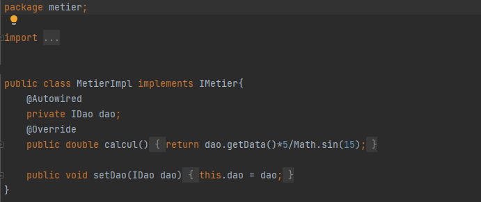
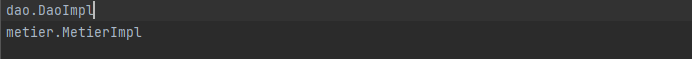
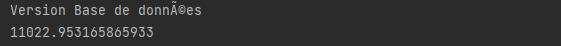

<h1 align="center">Mohamed ELYOUSFI</h1>
<h2 align="center"><💻 Compte Rendu des Travaux Pratiques JEE💻/></h2>

---

    
TP1 - Injection des dépendances par instanciation Statique/Dynamique/Framework<a href="https://github.com/ElyousfiMohamed/ELYOUSFI_Moahmed_JEE/tree/main/TP1%20-%20Semaine%201%20et%202%20(Injection%20de%20dependances)"> [Code source]</a>
 
    

        On considère le schéma suivant ou les classes sont liées par un couplage faible 
        

        <pre>Implémentation en java :
- Interface IDao et ses implémentations :</pre>
        
        
        
        <pre>- Interface IMetier et son implémentation :</pre>
        
        
        <h3>1- Injection des dépendances par instanciation Statique</h3>
        
        <pre>Résultat d'exécution :</pre>
        
        <h3>2- Injection des dépendances par instanciation Dynamique</h3>
        <pre>L'injection dynamique et faite à l'aide d'un fichier config.txt qui contient les noms des classes qui vont 
etre chargé dans la couche presentation</pre>
        
        <pre>1 : Chargement du fichier config.txt
2 : Lecture des noms complets(package + nom de la classe) des classes existant dans ce fichier
3 : Récuperation des instances de "Class" à partir des noms complet des classes 
4 : L'instanciation des classes(si ces classe ont un constructeur sans paramètre)
5 : Chargement et invocation(injection) du methode "setDao"</pre>
        
    <pre>Résultat d'exécution :</pre>
    
    <h3>3- Injection des dépendances avec Spring</h3>
    <pre><h4>3.1- Avec fichier beans.xml : </h4>
C'est un peu comme le principe de fichier de configuration dans l'injection dynamique, 
mais ici les instances sont passé a travers des beans</pre>
    
    <pre>Et aprés on va récupurer les beans par la méthode <b>"getBean"</b></pre>
    
    <pre>Résultat d'exécution :</pre>
    
    <pre><h4>3.2- Avec les annotations : </h4></pre>
    
    
    
    <pre>Résultat d'exécution :</pre>
    
    

    
TP2 - Java Persistence API (JPA) <a href="https://github.com/ElyousfiMohamed/ELYOUSFI_Moahmed_JEE/tree/main/TP2%20-%20Java%20Persistence%20API%20(JPA)"> [Code source]</a>

     
    

        Coming soon...
    

    
Mini Projet Framework d'Injection des dépendances <a href="https://github.com/ElyousfiMohamed/ELYOUSFI_Moahmed_JEE/tree/main/Mini%20Projet%20Framework%20d'Injection%20des%20d%C3%A9pendances"> [Code source]</a>

     
    

        Coming soon...
    

<h3>...</h3>

