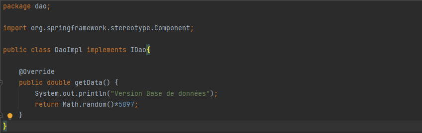
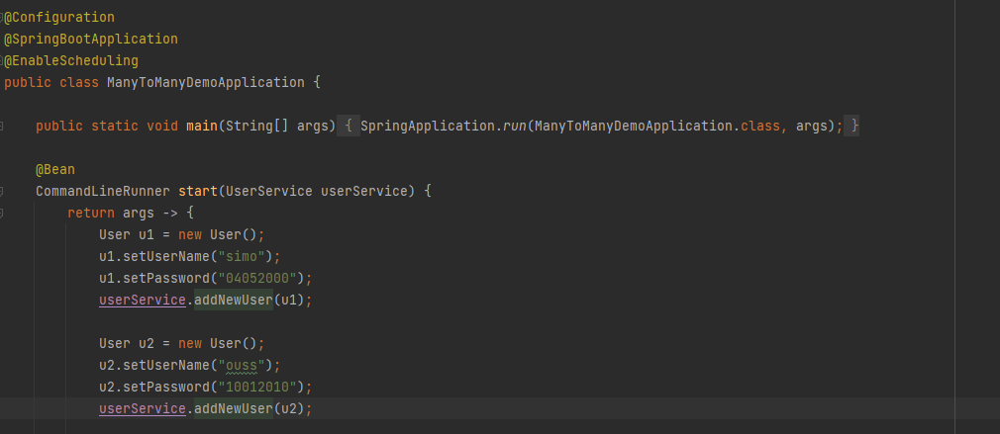
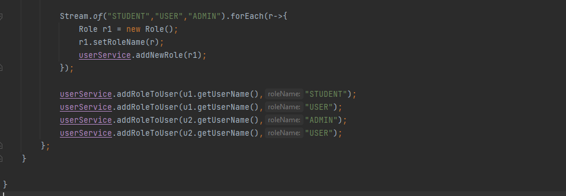
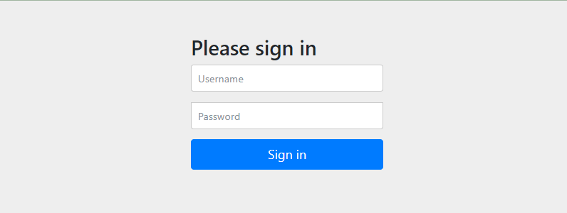

<h1 align="center">Mohamed ELYOUSFI</h1>
<h2 align="center"><💻 Compte Rendu des Travaux Pratiques JEE💻/></h2>  

    
Mini Projet Framework d'Injection des dépendances (cliquez  🖱) <a href="https://github.com/ElyousfiMohamed/ELYOUSFI_Moahmed_JEE/tree/main/Mini%20Projet%20Framework%20d'Injection%20des%20d%C3%A9pendances"> [Code source]</a>

     
    

        <!-- <h3>Conception</h3>
        Coming soon... 
        <h3>Realisation</h3>-->
        

    
1 - Avec XML
 
    

	<h4>Entity Obj : c'est l'objet qu'on va récuperer depuis le fichier XML</h4>
        
        <h4>Entity Objs : qui contient une list des objets | cette classe est mappé avec le fichier XML (XmlRootElement / XmlElement)</h4>
        
        <h4>Entity Property : qui va etre utilisé pour représenter soit le nom de setter (cas injection par setter) soit le nom d'attribut (cas injection               direct)</h4>
        
        <h4>Fichier XML</h4>
        
        <h5> 1.1 - Setter</h5>
        Injection par Setter en utilisant JAXB pour récuperer les objets depuis le fichier XML
        
    Simulation en utilisant l'exemple de [<a href="https://github.com/ElyousfiMohamed/ELYOUSFI_Moahmed_JEE/tree/main/TP1%20-%20Semaine%201%20et%202%20(Injection%20de%20dependances)">TP1</a>] 
        
         
        Appel à l'"injector" : 
         
        Résultat :  
        
        <h5> 1.2 - Constructeur</h5>
         
        Changement du nom de classe qu'on veut injecter son objet :  
         
        Résultat :  
        
        <h5> 1.3 - Accés direct</h5>
         
        Insertion du nom de l'attribut dans le fichier XML :  
         
        Résultat :  
        
    

    
2 - Avec ANNOTATIONS
 
    

	<h4>Création des annotations - Autowired</h4>
        
        <h4>Création des annotations - Component</h4>
        
        <h4>Classe Injector : scan sur les classes du package donné en parametres (burningwave)</h4>
        
        <h4>Variables necessaires</h4>
        
        <h4>Scan sur les annotations</h4>
        L'idée c'est de faire un scan sur tous les classes qu'on récuperer par "burningwave" pour localiser les annotations. 
        Si il est utilisé dans une méthode donc on va stocker cette méthode et c'est donc l'injection par "setter". 
        Si il est utilisé dans un constructeur donc on va stocker cet constructeur et c'est donc l'injection par "constructeur". 
        Si il est utilisé dans un field (attribut) donc on va stocker cet attribut et c'est donc l'injection par "accés direct". 
        
        <h4>Objet concerner par l'injection</h4>
        Déclaration de l'objet concerner par l'injection comme un attribut de la classe Injector2 pour le retourner au utilisateur aprés : 
        
        <h4>Injection</h4>
        
        Simulation en utilisant l'exemple de [<a href="https://github.com/ElyousfiMohamed/ELYOUSFI_Moahmed_JEE/tree/main/TP1%20-%20Semaine%201%20et%202%20(Injection%20de%20dependances)">TP1</a>] 
        
        
        <h5> 1.1 - Setter</h5>
        
        Résultat :  
        
        <h5> 1.2 - Constructeur</h5>
        Résultat :  
        
        <h5> 1.3 - Accés direct</h5>
        Résultat :  
        
    

    

---

    
TP1 - Injection des dépendances (cliquez  🖱) <a href="https://github.com/ElyousfiMohamed/ELYOUSFI_Moahmed_JEE/tree/main/TP1%20-%20Semaine%201%20et%202%20(Injection%20de%20dependances)"> [Code source]</a>
 
    

        On considère le schéma suivant ou les classes sont liées par un couplage faible 
        

        <pre>Implémentation en java :
- Interface IDao et ses implémentations :</pre>
        
        
        
        <pre>- Interface IMetier et son implémentation :</pre>
        
        
        <h3>1- Injection des dépendances par instanciation Statique</h3>
        
        <pre>Résultat d'exécution :</pre>
        
        <h3>2- Injection des dépendances par instanciation Dynamique</h3>
        <pre>L'injection dynamique et faite à l'aide d'un fichier config.txt qui contient les noms des classes qui vont 
etre chargé dans la couche presentation</pre>
        
        <pre>1 : Chargement du fichier config.txt
2 : Lecture des noms complets(package + nom de la classe) des classes existant dans ce fichier
3 : Récuperation des instances de "Class" à partir des noms complet des classes 
4 : L'instanciation des classes(si ces classe ont un constructeur sans paramètre)
5 : Chargement et invocation(injection) du methode "setDao"</pre>
        
    <pre>Résultat d'exécution :</pre>
    
    <h3>3- Injection des dépendances avec Spring</h3>
    <pre><h4>3.1- Avec fichier beans.xml : </h4>
C'est un peu comme le principe de fichier de configuration dans l'injection dynamique, 
mais ici les instances sont passé a travers des beans</pre>
    
    <pre>Et aprés on va récupurer les beans par la méthode <b>"getBean"</b></pre>
    
    <pre>Résultat d'exécution :</pre>
    
    <pre><h4>3.2- Avec les annotations : </h4></pre>
    
    
    
    <pre>Résultat d'exécution :</pre>
    
    

---

    
TP2 - Java Persistence API (JPA) (cliquez  🖱) <a href="https://github.com/ElyousfiMohamed/ELYOUSFI_Moahmed_JEE/tree/main/TP2%20-%20Java%20Persistence%20API%20(JPA)"> [Code source]</a>

     
    

        <h3>Spring Data</h3> 
        
        <h3>Application.properties</h3>   
        
        <h3>Entité Patient</h3>  
        
        <h3>Patient Repository</h3>  
         
        <h3>Application Spring</h3>  
         
        <h3>h2-console</h3>  
         
        <h3>Table Patient</h3>  
         
    

---

    
TP2 - JPA (Associations OneToOne, ManyToOne) (cliquez  🖱) <a href="https://github.com/ElyousfiMohamed/ELYOUSFI_Moahmed_JEE/tree/main/TP2%20-%20JPA%20(Associations%20%20OneToOne%2C%20ManyToOne)"> [Code source]</a>

     
    

        <h3>Diagramme de classe</h3>
        
        <h3>Les modeles</h3>
        <h5>- Consultation</h5>
        
        <h5>- Medecin</h5>
        
        <h5>- Patient</h5>
        
        <h5>- RendezVous</h5>
        
        <h5>- Enumeration statusRdv</h5>
        
        <h3>Repositories</h3>   
        <h5>- Consultation Repository</h5>
         
        <h5>- Medecin Repository</h5>
         
        <h5>- Patient Repository</h5>
         
        <h5>- RendezVous Repository</h5>
        
        <h3>Couche metier (Service)</h3>   
        <h5>- Interface IHospitalService</h5>
         
        <h5>- Une implémentation de cette interface</h5>
         
        <h3>JpaAssociationsApplication</h3>   
         
        
        <h3>application.properties</h3>   
         
        <h3>Les tables dans la bdd H2</h3>   
        <h5>- Consultation</h5>
         
        <h5>- Medecin</h5>
         
        <h5>- Patient</h5>
         
        <h5>- RendezVous</h5>
        
    

---

    
TP2 - JPA (Association ManyToMany) (cliquez  🖱) <a href="https://github.com/ElyousfiMohamed/ELYOUSFI_Moahmed_JEE/tree/main/TP2%20-%20JPA%20(Association%20ManyToMany)"> [Code source]</a>

     
    

        <h3>Diagramme de classe</h3>
        
        <h3>Les modeles</h3>
        <h5>- Role</h5>
        
        <h5>- User</h5>
        
        <h3>Repositories</h3>   
        <h5>- Role Repository</h5>
         
        <h5>- User Repository</h5>
         
        <h3>Couche metier (Service)</h3>   
        <h5>- Interface UserService</h5>
         
        <h5>- Une implémentation de cette interface</h5>
         
        <h3>ManyToManyDemoApp (main)</h3>   
         
        
        <h3>application.properties</h3>   
         
        <h3>Les tables dans la bdd phpMyAdmin</h3>   
        <h5>- role</h5>
         
        <h5>- user</h5>
         
        <h5>- user_roles</h5>
         
    

---

    
TP3 - Spring MVC (cliquez  🖱) <a href="https://github.com/ElyousfiMohamed/ELYOUSFI_Moahmed_JEE/tree/main/TP3%20-%20MVC%20Patients"> [Code source]</a>
 
    

        <h3>Affichage des patients</h3>
        <h5>- Entity Patient</h5>
        
        <h5>- Patient Repository</h5>
        
        <h5>- Patient Controller</h5>
        
        <h5>- Application</h5>   
         
        <h5>- Affichage des patients dans une template Thymeleaf</h5>
         
         
        <h3>Pagination</h3>
        <h5>- Génération des données pour faire la pagination</h5>
         
        <h5>- barre de pagination</h5>   
         
        <h5>- L'ajout des params 'size' et 'page' dans le Controlleur</h5>
        
        <h5>- Affichage</h5>   
         
         
        <h3>Recherche</h3>
        <h5>- Patient Repository (ajout de "findByNomContains a keyword")</h5>
         
        <h5>- Patient Controller (ajout de param keyword)</h5>   
         
        <h5>- Ajout du formulaire de recherche</h5>
        
        <h5>- L'ajout du mot clé dans le lien, pour naviger entre les pages aprés la recherche par un mot clé</h5>   
         
        <h5>- Affichage</h5>
         
         
        <h3>Suppression</h3>
        <h5>- Ajout de lien de suppression (/delete?id) dans la template</h5>
         
        <h5>- Ajout des paths "/" et "/delete" ("/" pour la redirection)</h5>   
         
         
        <h5>- Affichage</h5>
         
         
        <h3>Ajout</h3>
        <h5>- Ajout des paths "/new" et "/create" dans le controlleur</h5>
         
        <h5>- Ajout d'un fragement navbar pour l'insérer dans chacune des templates (index/new/update)</h5>   
         
         
        <h5>- Formulaire de saisie des données de patient</h5>
         
        <h5>- Affichage</h5>
         
        
        <h5>- Vérification</h5>
        
        <h3>Modification</h3>
        <h5>- Ajout du path "/update" dans le controlleur</h5>   
         
        <h5>- Formulaire de modification des données de patient</h5>
         
        <h5>- Affichage</h5>
         
        
        
        <h3>Spring Security - inMemoryAuthentication</h3>
        <h5>- Ajout user1 et admin</h5>   
        
        <h5>- Les droits d'acces et login form</h5>
         
        
        
        
        
        <h5>- path access denied "/403" </h5>
         
        
        
        <h3>Spring Security - jdbcAuthentication</h3>
        <h5>- Table users </h5>   
        
        <h5>- Table roles</h5>
        
        <h5>- Table users_role (table d'association)</h5>
        
        <h5>- Récuperation des users et roles</h5>
        
        
    

<h3>...</h3>

